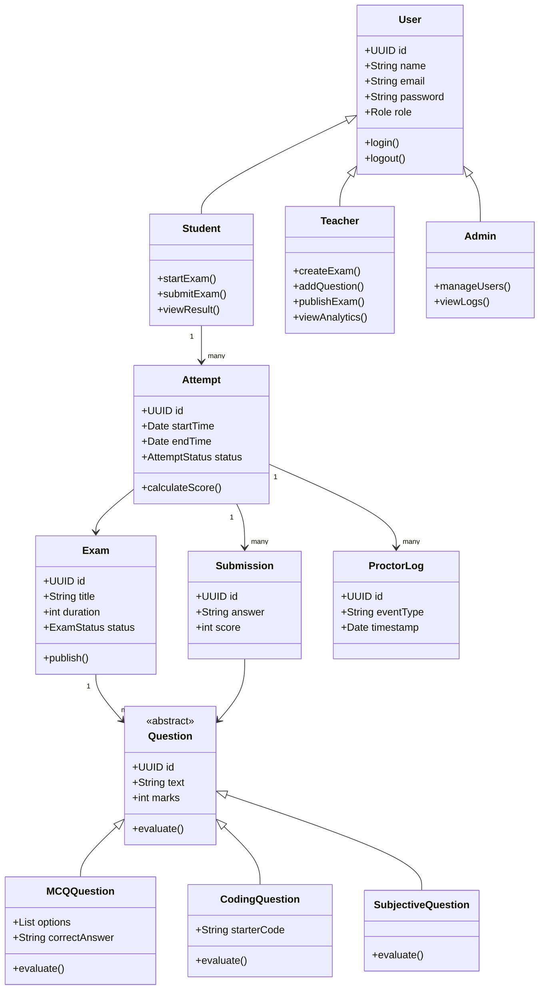

```mermaid
classDiagram

class User {
  +UUID id
  +String name
  +String email
  +String password
  +Role role
  +login()
  +logout()
}

class Student {
  +startExam()
  +submitExam()
  +viewResult()
}

class Teacher {
  +createExam()
  +addQuestion()
  +publishExam()
  +viewAnalytics()
}

class Admin {
  +manageUsers()
  +viewLogs()
}

User <|-- Student
User <|-- Teacher
User <|-- Admin

class Exam {
  +UUID id
  +String title
  +int duration
  +ExamStatus status
  +publish()
}

class Question {
  <<abstract>>
  +UUID id
  +String text
  +int marks
  +evaluate()
}

class MCQQuestion {
  +List options
  +String correctAnswer
  +evaluate()
}

class CodingQuestion {
  +String starterCode
  +evaluate()
}

class SubjectiveQuestion {
  +evaluate()
}

Question <|-- MCQQuestion
Question <|-- CodingQuestion
Question <|-- SubjectiveQuestion

class Attempt {
  +UUID id
  +Date startTime
  +Date endTime
  +AttemptStatus status
  +calculateScore()
}

class Submission {
  +UUID id
  +String answer
  +int score
}

class ProctorLog {
  +UUID id
  +String eventType
  +Date timestamp
}

Student "1" --> "many" Attempt
Exam "1" --> "many" Question
Attempt "1" --> "many" Submission
Attempt "1" --> "many" ProctorLog
Submission --> Question
Attempt --> Exam
```