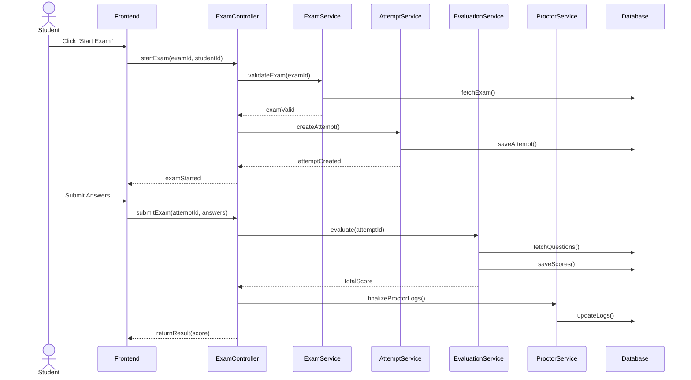

```mermaid 
sequenceDiagram
actor Student
participant Frontend
participant ExamController
participant ExamService
participant AttemptService
participant EvaluationService
participant ProctorService
participant Database

Student->>Frontend: Click "Start Exam"
Frontend->>ExamController: startExam(examId, studentId)
ExamController->>ExamService: validateExam(examId)
ExamService->>Database: fetchExam()
ExamService-->>ExamController: examValid

ExamController->>AttemptService: createAttempt()
AttemptService->>Database: saveAttempt()
AttemptService-->>ExamController: attemptCreated

ExamController-->>Frontend: examStarted

Student->>Frontend: Submit Answers
Frontend->>ExamController: submitExam(attemptId, answers)

ExamController->>EvaluationService: evaluate(attemptId)
EvaluationService->>Database: fetchQuestions()
EvaluationService->>Database: saveScores()

EvaluationService-->>ExamController: totalScore

ExamController->>ProctorService: finalizeProctorLogs()
ProctorService->>Database: updateLogs()

ExamController-->>Frontend: returnResult(score)
```