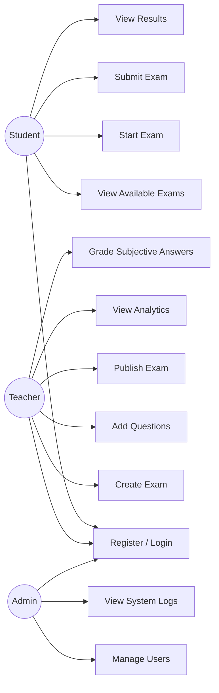

```mermaid
flowchart LR

%% Actors
Student((Student))
Teacher((Teacher))
Admin((Admin))

%% Use Cases
UC1[Register / Login]
UC2[View Available Exams]
UC3[Start Exam]
UC4[Submit Exam]
UC5[View Results]

UC6[Create Exam]
UC7[Add Questions]
UC8[Publish Exam]
UC9[View Analytics]
UC10[Grade Subjective Answers]

UC11[Manage Users]
UC12[View System Logs]

%% Relationships
Student --> UC1
Student --> UC2
Student --> UC3
Student --> UC4
Student --> UC5

Teacher --> UC1
Teacher --> UC6
Teacher --> UC7
Teacher --> UC8
Teacher --> UC9
Teacher --> UC10

Admin --> UC1
Admin --> UC11
Admin --> UC12
```